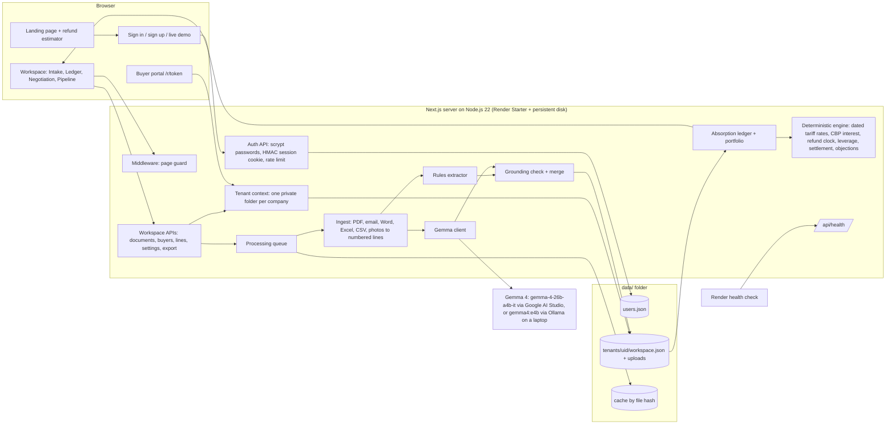

# ClawBack

> Indian exporters cut their prices in 2025 so US buyers could absorb Trump-era IEEPA tariffs. The US Supreme Court struck those tariffs down and the refunds are going to the buyers. ClawBack reads the exporter's invoices, emails and bank certificates, proves line by line how much of each buyer's refund the exporter's discounts paid for, and produces the claim pack, settlement options and buyer link to get that money back.

## Team

**Team Name:** Team ClawBack


| Member              | Contribution                                                                  |
| ------------------- | ----------------------------------------------------------------------------- |
| Sai Sri Ram Pitta   | Team lead, product idea, calculation engine (tariff rates, interest, ledger)  |
| Tanish Kinthali     | Document extraction pipeline, Gemma integration and grounding check           |
| Adithya Bukkineni   | Frontend, design system, landing page and refund estimator                    |
| Harshith Reddy      | Authorization, API endpoints, Render deployment                               |


## Problem Statement

### The Problem

From April 2025 the United States put "reciprocal" tariffs on Indian goods under the International Emergency Economic Powers Act (IEEPA): 10% from 5 April 2025, 25% from 7 August and 50% combined from 27 August 2025. To keep their US customers, thousands of Indian exporters (textiles in Karur and Tiruppur, engineering goods, chemicals) **cut their prices** so the US buyer could pay the duty without losing money.

On **20 February 2026** the US Supreme Court held that IEEPA does not authorise tariffs. US Customs (CBP) is now refunding the duty, **with interest**, through its CAPE process. But the refund goes to the **importer of record**, which for FOB, CIF and CFR shipments is the US buyer. So the buyer is refunded a duty that the Indian exporter partly paid for through discounts.

- About **$166 billion** of IEEPA tariffs are being refunded; roughly **$12 billion** relates to goods from India.
- There is **no legal mechanism** that forces the buyer to share the refund. The exporter's only route is a well-documented commercial request.
- Exporters today try this with spreadsheets and phone calls. Their evidence is scattered across PDF invoices, email threads and bank realisation certificates (e-BRC, FIRA).

### Why We Chose This Problem

It is real money, it is happening now, and it lands on small and medium Indian exporters who have no lawyers in the US. A mid-sized exporter can be owed ₹50 lakh to several crore. The work needed to claim it (matching invoices to price revisions, applying the right dated tariff rate, computing CBP interest, writing a persuasive claim) is exactly what software does well. We found no tool built for the exporter's side of this refund.

## Solution

ClawBack is a web app where an exporter signs in, uploads their documents and gets back a ready-to-send claim for each US buyer.

1. **Reads** invoices, price-revision emails, Excel sheets and bank certificates (and even phone photos of invoices) with Gemma, an open AI model, plus a deterministic rules engine.
2. **Proves** each number: every value is linked to the exact line of the document it came from.
3. **Computes** with plain code: duty paid, the part the exporter absorbed, the absorption ratio and the fair share of the refund plus CBP interest.
4. **Negotiates**: a three-option settlement ladder, ready rebuttals to the four standard buyer objections, a live refund clock and a claim pack with numbered exhibits.
5. **Closes**: a private link where the buyer picks an option, shareable on WhatsApp or email, and a recovery pipeline that tracks the money.

### Key Features

- **Refund estimator (public landing page):** four sliders give an exporter a rupee estimate of what they are owed in ten seconds, before signing up.
- **Login and private workspaces:** each export company has its own account and its own isolated data; passwords are scrypt-hashed and sessions are signed cookies.
- **One-click live demo:** any visitor or judge gets a private sandbox pre-loaded with a fictional exporter (Kaveri Looms) and 30 realistic documents.
- **Click-to-proof absorption ledger:** click any number to open the source document with the line highlighted and a confidence badge; correct a value and everything recalculates.
- **Calculation receipt:** every computed number shows its formula with the real values plugged in.
- **Importer-of-record triage:** DDP shipments are routed to "claim directly from CBP"; FOB/CIF/CFR shipments go to the negotiation pack.
- **Live interest ticker:** shows, second by second, how much the buyer is earning by holding the exporter's share.
- **Settlement ladder:** full settlement, 50/50 split, or credit against the next orders (no cash leaves the buyer).
- **Objection handler:** rebuttals to "the discount was for volume", "it was FOB", "we passed it to retail" and "we haven't been refunded", each checked against the evidence.
- **Claim pack:** a printable letter with summary, ledger, method, exhibits and settlement menu.
- **Buyer response link + WhatsApp/email outreach:** a pre-written message with the link; the buyer's choice moves the claim through the pipeline automatically.
- **Recovery pipeline:** Drafted → Sent → Countered → Settled, with rupees recovered and the success fee.

## Innovation and Differentiation

- **The exporter's side of the refund.** Existing tools (customs brokers, US law firms, remittance fintechs like Skydo) help the *importer* file for the refund or *receive* it. Nobody builds the exporter's evidence and negotiation.
- **AI that cites its sources, never does the maths.** Gemma only reads documents and must quote the exact line for each value. A grounding check rejects any value not found on the cited line. All money is computed by tested TypeScript with a dated tariff table, so the same documents always give the same claim.
- **Negotiation, not just calculation.** A buyer cannot be forced to pay, so ClawBack designs the ask: leverage scoring, a "credit on next orders" option that costs the buyer no cash, rebuttals with evidence, and a buyer link that turns a reply into a recorded decision.
- **Built for Indian exporters.** Reads e-BRC and FIRA bank certificates, shows rupees in lakh and crore, shares on WhatsApp, and runs fully offline on a laptop with an open model so pricing data never has to leave the company.
- **Business model built in.** 7% success fee shown on the pipeline, flat ₹4,999 claim packs for self-serve exporters, and distribution through export promotion councils and chartered accountants.

## Technical Implementation

### Architecture



### Technology Stack


| Category        | Technologies                                                                                                                                  |
| --------------- | --------------------------------------------------------------------------------------------------------------------------------------------- |
| Frontend        | Next.js 15 (App Router), React 19, TypeScript, hand-written CSS design system, Bricolage Grotesque, Plus Jakarta Sans and IBM Plex Mono fonts |
| Backend         | Next.js route handlers and middleware on Node.js 22, Zod validation, Node crypto (scrypt, HMAC-SHA256), AsyncLocalStorage for tenant isolation |
| Database        | File-based JSON store: one `workspace.json` per company with atomic writes and backups, `users.json` for accounts (no external database)       |
| AI / ML         | Gemma 4 (`gemma-4-26b-a4b-it`) through Google AI Studio (Gemini API) in the cloud, or Gemma 4 (`gemma4:e4b`) through Ollama offline on a laptop; deterministic rules engine cross-check |
| Infrastructure  | Render Starter web service (always on) with a 1 GB persistent disk, deployed from the `render.yaml` blueprint; GitHub                        |
| APIs / Services | Google AI Studio Gemini API (`generateContent`) serving Gemma 4, Ollama chat API, WhatsApp click-to-chat links (`wa.me`), `mailto:` email drafts |


### How It Works

1. **Sign in.** `middleware.ts` sends signed-out visitors to the landing page or sign-in page. Every API route is wrapped in `route()` (`src/lib/server/api.ts`), which verifies the signed session cookie and runs the request inside that company's tenant context, so all reads and writes go to `data/tenants/<uid>/`.
2. **Upload.** Files go to `/api/documents`, are stored in the company's uploads folder and queued.
3. **Ingest.** `src/lib/extraction/ingest.ts` turns every format into numbered text lines (pdf.js for PDFs, postal-mime for emails, mammoth for Word, read-excel-file for Excel). Scanned PDFs and photos are transcribed by Gemma.
4. **Extract.** The rules engine (`rules.ts`) and Gemma (`gemma.ts`) each read the fields: invoice number, dates, HS code, quantity, unit price, Incoterm, baseline and revised prices, amount realised. Gemma runs at temperature 0 with a fixed seed and must return the line number and a verbatim quote for each value.
5. **Ground and merge.** `ground.ts` checks each quote is really on the cited line. Values that fail are flagged "check" and the rules engine's reading is preferred. Results are cached by file hash.
6. **Match buyers.** `buyers.ts` attaches each document to a buyer by name, alias or email domain.
7. **Compute.** `ledger.ts` and `src/lib/engine/` build the absorption ledger:
   ```
   tariff_paid      = customs_value × IEEPA_rate(entry_date, loading_date)
   absorbed         = min((baseline_price − revised_price) × qty, tariff_paid)
   absorption_ratio = absorbed ÷ tariff_paid
   fair_claim       = absorption_ratio × (refund + CBP interest)
   ```
8. **Negotiate and close.** The buyer page shows the refund clock, leverage, settlement ladder and objections. The claim pack is rendered at `/claim/<buyerId>`. The public buyer link `/r/<uid>.<token>` carries its owner's id, so it opens the right company's data and nothing else.

### Technical Decisions

- **Gemma reads, code calculates.** Language models are good at reading messy documents and bad at arithmetic. Keeping every rupee in deterministic, unit-tested code makes the claim reproducible and defensible in front of a buyer.
- **Grounding over trust.** Requiring a line number and verbatim quote for every value lets us verify the model automatically and show the proof to the user.
- **Rules engine as a cross-check and safety net.** Gemma reads every document and the rules engine reads it too; when they agree the value is marked verified. If Gemma is rate-limited or unreachable, the rules engine keeps the app working and the document is flagged. Hosted calls retry automatically on rate limits.
- **Gemma everywhere, two ways.** In the cloud, Gemma 4 is called through Google AI Studio (the Gemini API) with the key kept on the server and sent as a header. On a laptop, the same Gemma 4 family runs offline through Ollama, so an exporter's pricing data never has to leave their machine. One setting switches between them.
- **File store with tenant isolation instead of a database.** A JSON file per company with serialised, atomic writes is simple, portable and easy to back up, and AsyncLocalStorage lets every existing function become multi-tenant without passing a user id through every call.
- **Stateless signed sessions.** HMAC-SHA256 tokens in HttpOnly, SameSite=Lax cookies (Secure over HTTPS) work in both the Edge middleware and Node routes using Web Crypto, with no session table.
- **Security basics.** scrypt password hashing with per-user salt and timing-safe comparison, identical errors for unknown email and wrong password, a lock after 8 failed sign-ins in 15 minutes, validated account ids to prevent path traversal, and separate disposable sandboxes for demo visitors.

## Implementation During the Hackathon

During Hack Day we took the ClawBack prototype (document reading, ledger and claim pack running on one laptop) and turned it into a deployable, multi-user product:

- Added **authorization**: sign up, sign in, sign out, signed session cookies, middleware page guard, rate limiting and per-company data isolation, with new automated tests for login, isolation and the Google AI Studio client (37 in total).
- Added the **one-click live demo** that creates a private sandbox per visitor so judges can try everything without an account.
- Built the **public landing page** with the interactive **refund estimator**, the three-step explainer and **pricing**.
- Redesigned the whole interface with a new **indigo, rani pink and marigold** design system, new typography, icons, a mobile layout and a refreshed buyer portal.
- Added **WhatsApp and email outreach** with a ready-written message and the buyer link, and the **live interest ticker**.
- Prepared **cloud deployment**: `render.yaml` blueprint for an always-on Render Starter service with a persistent disk, `/api/health` endpoint, `0.0.0.0` binding.
- Made **Gemma 4 mandatory and portable**: a native Google AI Studio (Gemini API) connection to `gemma-4-26b-a4b-it` alongside local Ollama, a one-click `setup-gemma.bat`, and a shared extraction cache so every demo sandbox after the first loads instantly.

### Team Contributions

- **Sai Sri Ram Pitta:** Led the team and the product direction; owned the calculation engine (dated tariff rates, CBP interest, absorption ledger, leverage and settlement ladder) and the pitch.
- **Tanish Kinthali:** Built the document pipeline: ingestion of PDFs, emails, Word and Excel files, the rules extractor, the Gemma client and the grounding check.
- **Adithya Bukkineni:** Designed and built the interface: the new design system, landing page and refund estimator, portfolio, buyer pages and buyer portal.
- **Harshith Reddy:** Implemented authorization and private workspaces, the API endpoints, the health check and the Render deployment, and tested the end-to-end flow.

### Challenges and Learnings

- **Making AI output trustworthy.** Early model answers sometimes put a value on the wrong line or invented a date. The grounding check, which moves or rejects citations, fixed this, and we learned to treat the model as a reader, not a calculator.
- **Tariff dates are tricky.** The rate depends on the entry date, with exceptions for goods loaded before a change. We encoded the dated rate table and in-transit rules and covered them with tests.
- **Adding accounts to a single-user app.** Rather than rewriting every function, we used AsyncLocalStorage so each request carries its company id down to the file store and the background queue.
- **Hosting state in the cloud.** Accounts and uploads must survive redeploys, so we run on Render's always-on Starter plan with a persistent disk, and the Gemma extraction cache on that disk makes every demo after the first instant.
- **Hosted model limits.** Free API keys have rate limits, so the Gemma client retries 429/503 responses with backoff and the rules engine covers any document Gemma could not read.
- **Designing the ask, not just the number.** Talking through buyer objections taught us that a "credit on the next order" option is more persuasive than a cash demand.

## Working Application

1. **Portfolio:** ₹2.85 crore recoverable across 6 buyers, ranked by amount × leverage, with the live interest ticker.
2. **Buyers → Brightwater Home Supply → Absorption ledger:** click any number to see its source line.
3. **Negotiation tab:** refund clock, settlement ladder, objection rebuttals, buyer link and **Share on WhatsApp**.
4. **Claim pack** button: the printable claim letter with exhibits.
5. Open the **buyer link** in a private window, choose Option C, and watch the buyer move to *Settled* in the **Recovery pipeline**.
6. **Intake:** upload any file from the `demo/extra` folder or paste the email in `demo/try-pasting-this-email.txt`.


## Demo Video

**Demo Video:** https://drive.google.com/file/d/1-Rn2jZFy0Zqt1VkTu9YMAuCvZag_VCrS/view?usp=sharing

A 1-minute walkthrough: the problem and the ₹2.85 crore portfolio, uploading a phone photo of an invoice, click-to-proof on the ledger, the calculation receipt, correcting a value, the refund clock and live interest ticker, the settlement ladder and an objection rebuttal, the claim pack, sending the buyer link on WhatsApp, the buyer accepting Option C, and the pipeline updating.

## Open Source and AI Usage

### AI / Models

- **Gemma 4 (`gemma-4-26b-a4b-it`) by Google DeepMind, via Google AI Studio (Gemini API):** used on the deployed site to classify documents, extract field values with line citations, and transcribe photos and scanned PDFs.
- **Gemma 4 (`gemma4:e4b`) via Ollama:** the same role, fully offline on a laptop. Gemma 4 is released under the Apache 2.0 licence.
- **No AI in the calculations:** all amounts, rates, interest, leverage and settlement figures are computed by deterministic TypeScript.

### Open Source Components

- **Next.js / React:** web framework and UI (MIT).
- **TypeScript / Zod:** typing and input validation (Apache 2.0 / MIT).
- **unpdf (pdf.js):** PDF text and page-image extraction (MIT / Apache 2.0).
- **postal-mime:** parsing `.eml` email files (MIT-0).
- **mammoth:** reading Word `.docx` files (BSD-2-Clause).
- **read-excel-file:** reading Excel `.xlsx` files (MIT).
- **pdf-lib:** generating the demo PDFs (MIT).
- **Vitest:** automated tests (MIT).
- **Fontsource: Bricolage Grotesque, Plus Jakarta Sans, IBM Plex Mono and IBM Plex Serif:** typefaces (SIL Open Font License 1.1).
- **Ollama:** local model runtime (MIT).
- **Google AI Studio / Gemini API:** hosted Gemma 4 inference.
- **Demo dataset (`demo/`):** 30 synthetic documents for a fictional exporter and seven fictional US buyers, generated by `scripts/make-demo-docs.mjs`. All names, addresses, banks and vessels are invented.
- **Public sources for rates and process:** CBP CAPE guidance, HTSUS 9903.02 headings, Federal Register CBP interest-rate notices and law-firm advisories, listed in the app under **Method & sources**.

All third-party components are used under their own licences, listed above.

## Setup and Usage

### Prerequisites

- Node.js 22 LTS or newer (https://nodejs.org)
- Gemma 4, either way:
  - a free Google AI Studio API key (https://aistudio.google.com/apikey), or
  - Ollama (https://ollama.com/download) with `ollama pull gemma4:e4b` (about 10 GB, offline)

### Installation

```bash
git clone https://github.com/YOUR-USERNAME/clawback.git
cd clawback
npm install
npm run build
```

Then set up Gemma once: double-click **`setup-gemma.bat`** (or `npm run setup:gemma`), choose Google AI Studio or Ollama, and it writes `.env.local` for you.

On Windows, **`start.bat`** installs, builds, checks Gemma and opens the app.

### Environment Variables

`setup-gemma.bat` writes these to `.env.local`; on Render they come from `render.yaml`. See `.env.example`.

```env
GEMMA_PROVIDER=google                 # google (Google AI Studio) or ollama (local)
GEMMA_MODEL=gemma-4-26b-a4b-it        # or gemma4:e4b with Ollama
GEMMA_API_KEY=your-ai-studio-key      # Google AI Studio only; stays on the server
CLAWBACK_ENGINE_MODE=auto             # Gemma reads, rules cross-check
AUTH_SECRET=a-long-random-string      # signs login cookies (auto-generated if unset)
CLAWBACK_DATA_DIR=./data              # accounts, workspaces, uploads (/var/data on Render)
```

### Running the Project

```bash
npm start                 # http://localhost:3000 (this computer only)
npm run start:lan         # reachable from other devices on your network
npm run dev               # development mode with hot reload
npm test                  # 37 automated tests
```

### Usage

1. Open the app and click **Create a free account** (or **Try the live demo**).
2. Check the top bar shows **Extraction engine: gemma-4-26b-a4b-it** (or your Ollama model). In **Settings**, fill in your company profile (name, IEC, GSTIN, signatory).
3. Go to **Intake** and drop your invoices, price-revision emails and e-BRC/FIRA files, or paste an email.
4. Open each buyer, check the **Absorption ledger** (click numbers to verify them) and fill in the **Profile** (relationship, revenue share, open orders).
5. In **Negotiation**, pick the settlement option to lead with and share the buyer link on WhatsApp or email; print the **Claim pack** as a PDF.
6. Track replies in the **Recovery pipeline**.


## Credits and License

### Credits

- Team: Sai Sri Ram Pitta, Tanish Kinthali, Adithya Bukkineni and Harshith Reddy.
- Gemma models by Google DeepMind; Ollama for local model serving.
- Next.js, React, TypeScript, Zod, unpdf/pdf.js, postal-mime, mammoth, read-excel-file, pdf-lib and Vitest.
- Bricolage Grotesque, Plus Jakarta Sans and IBM Plex typefaces via Fontsource.
- Tariff and refund facts summarised from CBP, the Federal Register, White & Case, Steptoe, C.H. Robinson advisories and BasisPoint Insight (full list in the app under Method & sources).
- Hosted on Render. Gemma 4 served by Google AI Studio.

ClawBack is negotiation support, not legal advice.

### License

MIT License. See [`LICENSE`](LICENSE).
- [ ] Devpost submission completed
- [ ] Devpost link added
- [x] Credits added
- [x] License added
- [x] Repository is organized and complete
